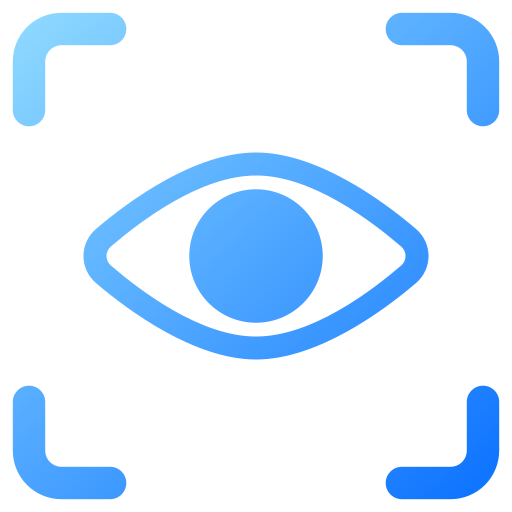
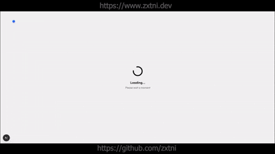

# FreelanceSuite

<div align="center">

💼 A sleek, modern freelance management dashboard built with Next.js 15, React 19, and TypeScript — manage clients, projects, invoices, and analytics effortlessly. ⚡


** Powered by GNU 3.0 License**

</div>

---

##  Preview

<div align="center">



*Experience the beautiful UI, smooth animations, and powerful features of FreelanceSuite*

</div>

---

##  Features

###  **Dashboard**
- Real-time statistics and KPIs
- Revenue tracking with Indian Rupee (₹) support
- Active clients and projects overview
- Recent activity timeline
- Upcoming project deadlines
- Quick action shortcuts

###  **Client Management**
- Complete client database
- Active/Inactive status tracking
- Client search and filtering
- Total revenue per client
- Project count tracking
- Add, edit, and delete clients

###  **Project Management**
- Project status tracking (Active, Completed, On Hold)
- Progress monitoring with visual indicators
- Budget and spent amount tracking
- Due date management
- Project grid and table views
- Filter and search capabilities

###  **Invoice Management**
- Invoice generation and tracking
- Multiple status support (Paid, Pending, Overdue)
- Revenue analytics
- Due date monitoring
- Client-linked invoicing
- INR currency formatting

###  **Analytics**
- Revenue trend charts (monthly breakdown)
- Client growth visualization
- Top clients by revenue (horizontal bar charts)
- Performance metrics with progress indicators
- Project status distribution
- Interactive Recharts integration

###  **Settings**
- Profile management with 3D holographic card
- Account security settings
- Notification preferences
- Billing configuration
- Integration settings
- Email template customization

###  **UI/UX**
- Dark mode optimized design
- Custom accent-colored cursor
- Smooth page transitions
- Responsive layout (mobile-first)
- Glass morphism effects
- Hover animations and micro-interactions
- Professional shadcn/ui components

---

##  Getting Started

### Prerequisites

- Node.js 18+ 
- pnpm (recommended) or npm

### Installation

1. **Clone the repository**
```bash
git clone https://github.com/zxtni/FreelanceSuite.git
cd FreelanceSuite
```

2. **Install dependencies**
```bash
pnpm install
# or
npm install
```

3. **Run the development server**
```bash
pnpm dev
# or
npm run dev
```

4. **Open your browser**
```
http://localhost:3000
```

### Default Login Credentials

- **Email:** `admin@zxtni.dev`
- **Password:** `password`

---

##  Tech Stack

### Core
- **Framework:** Next.js 15.1.3
- **React:** 19.2.0
- **TypeScript:** 5.7.3
- **Styling:** Tailwind CSS 3.4.1

### UI Components
- **shadcn/ui** - High-quality React components
- **Radix UI** - Accessible component primitives
- **Lucide React** - Beautiful icons
- **Recharts** - Interactive charts and graphs

### Animation & Effects
- **Framer Motion** - Smooth animations
- **Custom Cursor** - Accent-colored mouse tracker
- **View Transitions API** - Page transition effects

### State & Data
- **JSON-based file storage** - Simple data persistence
- **React Hooks** - Modern state management
- **Server Components** - Next.js 15 features

---

##  Project Structure

```
FreelanceSuite/
├── app/                          # Next.js app directory
│   ├── (protected)/             # Protected routes layout
│   ├── analytics/               # Analytics page
│   ├── api/                     # API routes
│   │   ├── auth/               # Authentication endpoints
│   │   ├── clients/            # Client CRUD operations
│   │   ├── invoices/           # Invoice management
│   │   ├── projects/           # Project management
│   │   └── users/              # User management
│   ├── clients/                # Clients page
│   ├── dashboard/              # Dashboard page
│   ├── invoices/               # Invoices page
│   ├── login/                  # Login page
│   ├── projects/               # Projects page
│   ├── settings/               # Settings page
│   └── layout.tsx              # Root layout
├── components/                  # React components
│   ├── analytics/              # Analytics components
│   ├── clients/                # Client components
│   ├── dashboard/              # Dashboard components
│   ├── invoices/               # Invoice components
│   ├── projects/               # Project components
│   ├── settings/               # Settings components
│   └── ui/                     # UI primitives (shadcn)
├── contexts/                    # React contexts
│   ├── auth-context.tsx        # Authentication state
│   └── page-transition-context.tsx
├── data/                        # JSON database
│   ├── clients.json            # Client data
│   ├── invoices.json           # Invoice data
│   ├── projects.json           # Project data
│   └── users.json              # User data
├── hooks/                       # Custom React hooks
├── lib/                         # Utility functions
│   ├── auth.ts                 # Auth utilities
│   ├── db.ts                   # Database operations
│   ├── types.ts                # TypeScript types
│   └── utils.ts                # Helper functions
└── public/                      # Static assets
```

---

##  Key Features Explained

### Custom Cursor
A beautiful accent-colored cursor that follows your mouse movement throughout the entire application using Framer Motion.

### 3D Holographic Profile Card
Interactive profile card with:
- Mouse-tracking tilt effect
- Holographic shine animations
- Behind-glow effect
- Mobile device orientation support
- Smooth transitions

### Revenue Analytics
- Monthly revenue trends for current year
- Top 5 clients by revenue (horizontal bars)
- Performance metrics with colored progress bars
- Indian numbering system (Lakhs format)

### Newest-First Sorting
All lists (clients, projects, invoices) automatically show newest items first based on creation date.

---

##  Authentication

Simple session-based authentication:
- Login with email/password
- Session stored in localStorage
- Protected routes with HOC wrapper
- Auto-redirect to login if not authenticated

---

##  Localization

- **Currency:** Indian Rupee (₹)
- **Number Format:** Indian numbering system (Lakhs/Crores)
- **Date Format:** ISO 8601

---

##  GNU 3.0 License

This project is powered by **GNU General Public License v3.0**, ensuring:
- Free software distribution rights
- Source code availability
- Modification and redistribution freedom
- Copyleft protection for derivative works
- Patent grant protection
- Strong community-driven development

For more details, see the [GNU GPL v3.0](https://www.gnu.org/licenses/gpl-3.0.en.html).

---

##  Roadmap

- [ ] Database integration (PostgreSQL/MongoDB)
- [ ] Real-time updates with WebSockets
- [ ] Export functionality (PDF invoices)
- [ ] Email notifications
- [ ] Multi-user support with roles
- [ ] Advanced analytics and reports
- [ ] Calendar integration
- [ ] Task management
- [ ] Time tracking
- [ ] Payment gateway integration

---

##  Contributing

Contributions are welcome! Please feel free to submit a Pull Request.

1. Fork the repository
2. Create your feature branch (`git checkout -b feature/AmazingFeature`)
3. Commit your changes (`git commit -m 'Add some AmazingFeature'`)
4. Push to the branch (`git push origin feature/AmazingFeature`)
5. Open a Pull Request

---

##  License

This project is licensed under the MIT License - see the [LICENSE](LICENSE) file for details.

---

##  Author

**Rahul Mondal** ([@zxtni](https://github.com/zxtni))
- Senior Freelancer
- Passionate about building amazing digital experiences

---

##  Acknowledgments

- [Next.js](https://nextjs.org/) - The React Framework
- [shadcn/ui](https://ui.shadcn.com/) - Beautiful UI components
- [Radix UI](https://www.radix-ui.com/) - Accessible primitives
- [Recharts](https://recharts.org/) - Composable charting library
- [Framer Motion](https://www.framer.com/motion/) - Animation library
- [Tailwind CSS](https://tailwindcss.com/) - Utility-first CSS

---

<div align="center">

###  Star this repo if you find it helpful!

###  Questions? Open an issue or reach out to [@zxtni](https://github.com/zxtni)

**Made with  by Rahul Mondal**

</div>
